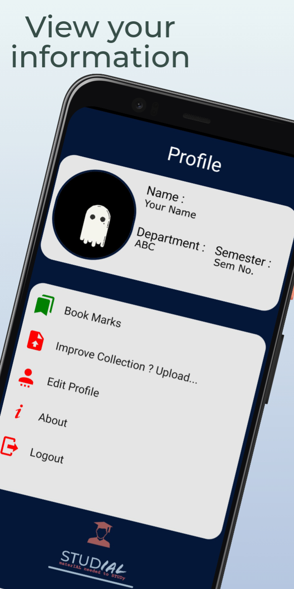
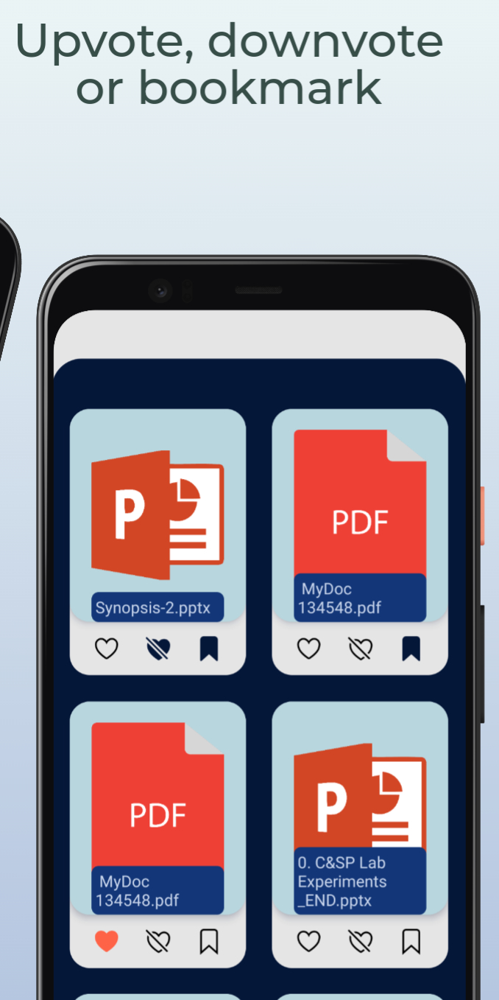
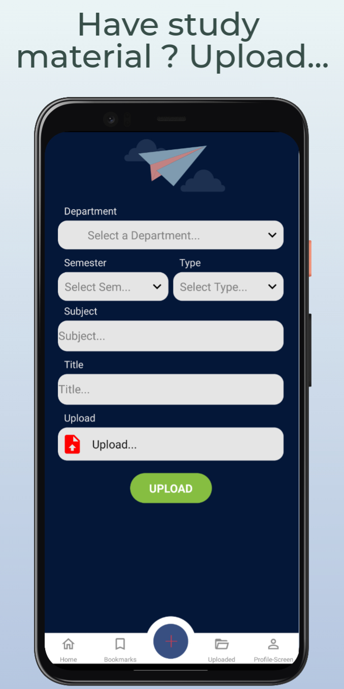
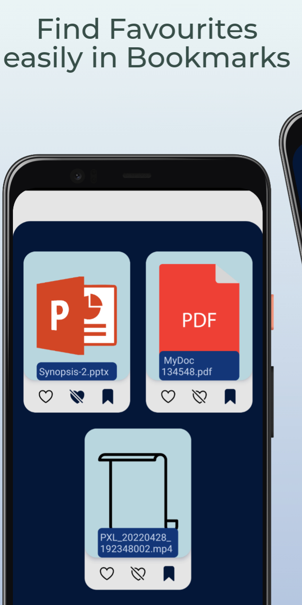

# Studial

### STUDIAL is STUDy + materIAL

The app is designed and created for sharing study materials using **React Native** to ensure hassle-free user experience, **NodeJs** for back-end and
Express JS to interact with **MongoDB**.

Features have been provided for uploading, upvoting, downvoting, bookmarking,and accessing notes, which can be in form of file or image of any type.

Custom authentication and data storage model are implemented, form validation is also performed.

Permission to alow access to media and camera is used, so as to allow user to upload study materials from device or click picture of study material.

Different screens are created for specified user application, and have been linked to allow them to interact with each other.

The code had been optimised wherever possible. Data-base is hosted using MongoDB Atlas, back-end through Heroku and apk is created for android.

  
  
  
  
  

# Apk
You can find and download the apk from the attached link.
<h5>
  <a href="Apk">Get the Apk here</a>
</h5>

# Setup

### Clone the repository
Via HTTPS: git clone https://github.com/sphoortimpatil/Studial.git

Via GitHub CLI: gh repo clone sphoortimpatil/Studial

### Download .zip file of repository
You can also download the .zip file and extract it in required directory.

# Installation Steps

**iOS & Android package installation:** npm install / yarn add

**Start server:** npm start / yarn start

**Run app:** npx react-native run-android / npx react-native run-ios

Alternatively, you can start both the serever and the app up by: npm run android / npm run ios

# Build Android App

**Using Windows:** cd android && gradlew assembleRelease

**Using Linux and Mac OSX:** cd android && ./gradlew assembleRelease

